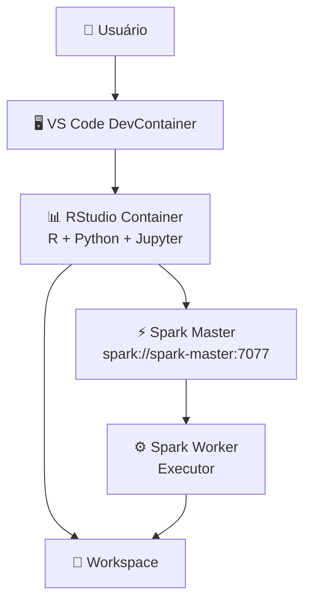
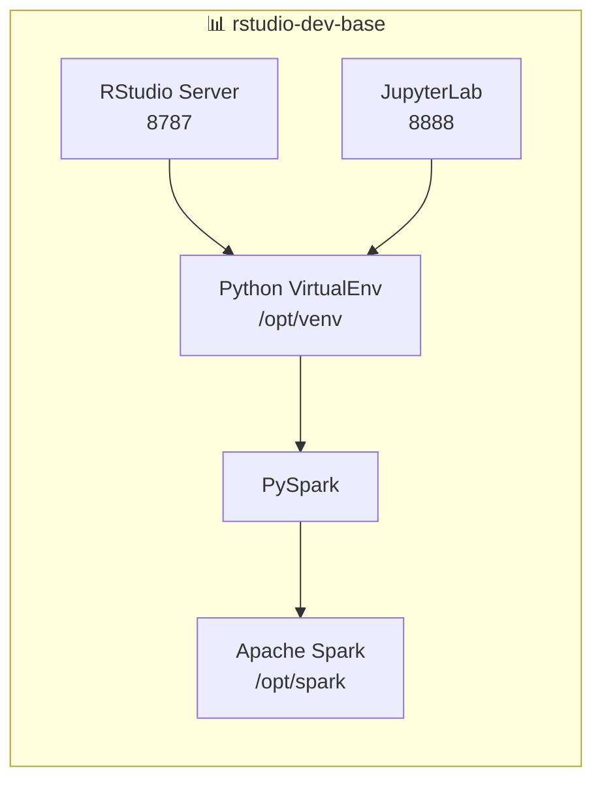
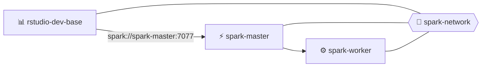
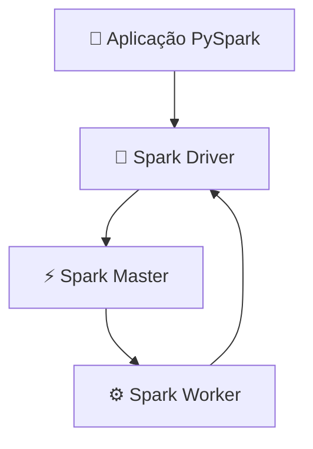
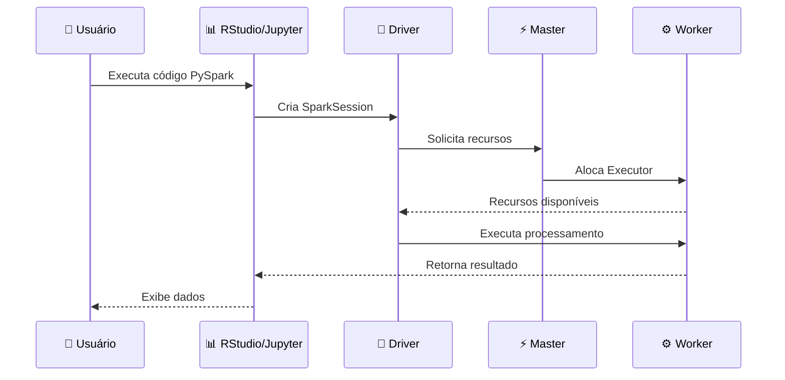
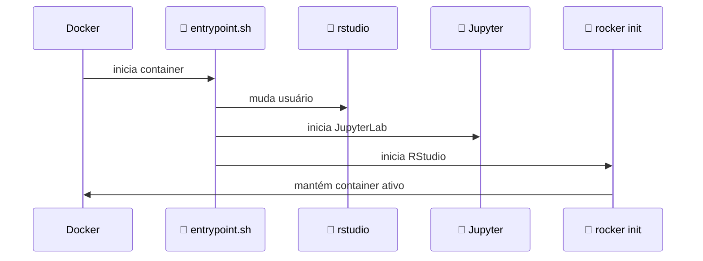
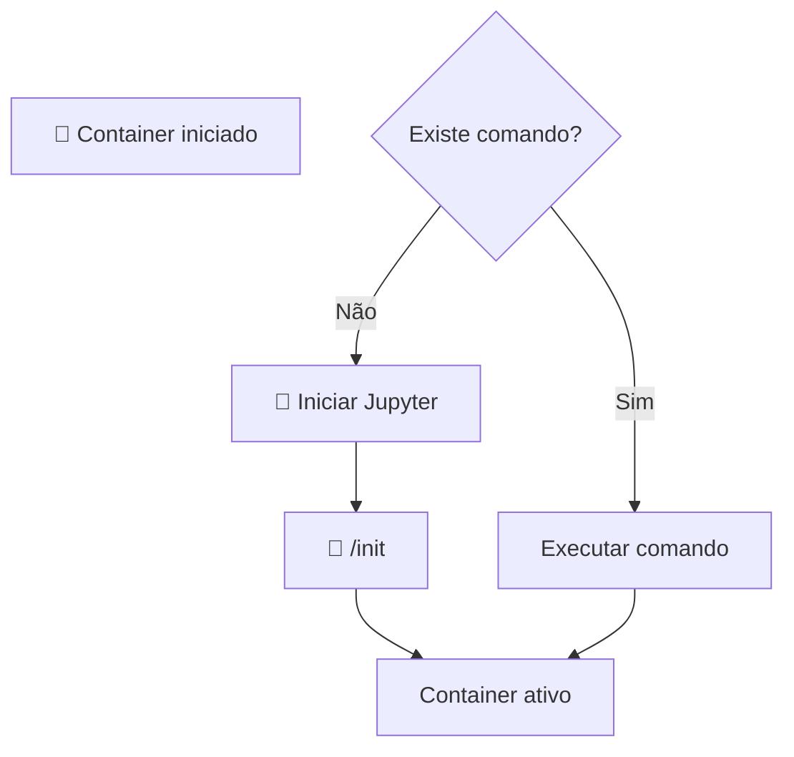
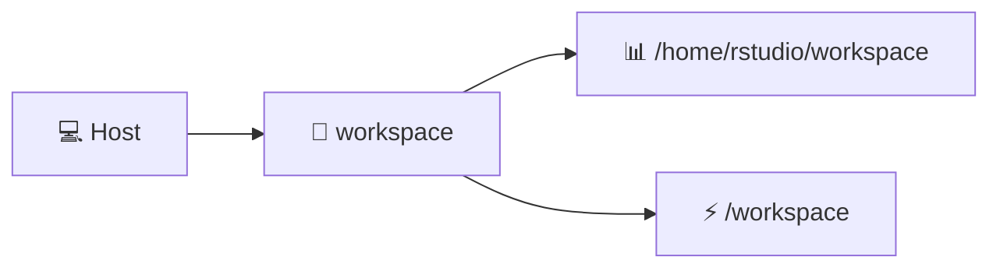
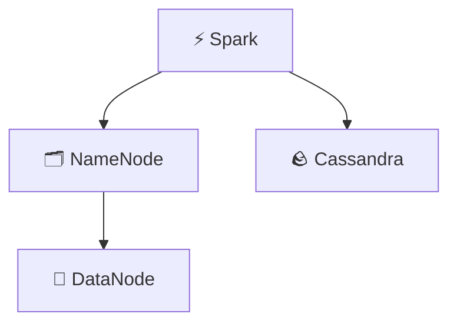

# 🎓 Ciência de Dados e Big Data Analytics

Repositório central dos estudos, anotações, exercícios e projetos desenvolvidos durante a pós-graduação em **Ciência de Dados e Big Data Analytics**, cursada na **Estácio de Sá**.

Este espaço funciona como um ponto de entrada para os módulos do curso, a fim de organizar e manter um monorepositório. Cada disciplina foi organizada em um sub-repositório próprio, facilitando a separação dos conteúdos por tema, semestre e área de estudo.

## 🧭 Visão Geral

O curso reúne fundamentos de programação, análise de dados, visualização, inteligência artificial e tecnologias aplicadas ao ecossistema de dados.

Neste repositório principal estão concentradas as referências para acesso aos módulos, enquanto cada sub-repositório guarda os materiais específicos de cada disciplina.

## 🧪 Ambiente de Desenvolvimento (Docker)

O projeto utiliza um ambiente Docker para garantir padronização, reprodutibilidade e isolamento das ferramentas utilizadas na pós-graduação em Ciência de Dados.

A arquitetura foi desenhada com separação de responsabilidades por container, simulando um ambiente profissional de engenharia de dados.

---

### 📊 Container do RStudio Server (R)

Ambiente dedicado para desenvolvimento em R baseado na imagem do Rocker Project.

**Responsabilidades:**
- Análise estatística e modelagem de dados
- Desenvolvimento de scripts em R
- Uso do RStudio via navegador
- Exploração de dados com `tidyverse`
- Construção de relatórios e pipelines analíticos

**Acesso:**
```text
http://localhost:8787
```

**Usuário padrão:**
```text
rstudio
```

**Senha:** definida no `docker-compose.yml` (variável `PASSWORD`)

**Pacotes comuns utilizados:**
- tidyverse
- data.table
- shiny
- ggplot2

---

### 📓 Container do JupyterLab (Python)

Ambiente dedicado para desenvolvimento em Python com suporte a notebooks interativos.

**Responsabilidades:**
- Análise exploratória de dados (EDA)
- Machine Learning com scikit-learn
- Visualização com matplotlib e seaborn
- Processamento de dados com pandas e polars
- Execução de notebooks (.ipynb)
- Suporte a kernel R via IRkernel

**Acesso:**
```text
http://localhost:8888
```

**Principais bibliotecas:**
- numpy
- pandas
- matplotlib
- seaborn
- scikit-learn
- pyarrow
- polars

---

# 🚀 Plataforma Data Science + Apache Spark + RStudio + Jupyter

## 📌 Visão Geral

Ambiente integrado para:

* 🧪 RStudio Server
* 🐍 Python + JupyterLab
* ⚡ Apache Spark Cluster
* 🔥 PySpark
* 📦 Docker Compose
* 🖥️ VS Code DevContainer

---

# 🏗️ Arquitetura Macro



---

# 🧩 Arquitetura Micro - RStudio



---

# ⚡ Arquitetura da Plataforma

> Este diagrama representa a arquitetura de execução dos containers Docker, demonstrando a rede interna `spark-network`, o container de desenvolvimento RStudio atuando com Spark Driver e a comunicação com o cluster Spark Standalone composto pelo Master e Worker.

## 1. Diagrama de Arquitetura Docker Spark + RStudio



## 2. Diagrama de Arquitetura Spark Runtime



---

# 🔄 Sequência de Execução PySpark



---

# 🚀 Inicialização do Container



---

# 🔁 Fluxo do Entrypoint



---

# ☕ Java e Apache Spark

Spark 3.5.x utiliza melhor:

```
Spark 3.5.1

      |

      |

Java 17 LTS

      |

      |

PySpark

      |

      |

Python
```

Configuração:

```yaml
JAVA_HOME=/usr/lib/jvm/java-17-openjdk-amd64
```

## ⚠️ Java 26

Evitar:

```
openjdk-26
```

Motivo:

* incompatibilidade JVM
* bibliotecas Spark podem falhar
* versão fora do ciclo LTS

Recomendado:

```
Java 17
   +
Spark 3.5
   +
Python 3
```

---

# 🌐 Portas

| Porta | Serviço          |
| ----- | ---------------- |
| 8787  | RStudio          |
| 8888  | Jupyter          |
| 7077  | Spark Master RPC |
| 8080  | Spark Master UI  |
| 8081  | Spark Worker UI  |

---

# 🔗 Comunicação Docker

Dentro da rede Docker:

```
rstudio

   |

   |

spark://spark-master:7077

   |

   |

spark-worker

```

Não usar:

```
spark://localhost:7077
```

porque localhost dentro do container aponta para o próprio container.

---

# 📂 Volumes



---

# 🗄️ Futuro: HDFS + Cassandra

Arquitetura:



---

# 📌 Componentes atuais

✅ RStudio Server
✅ JupyterLab
✅ Python Virtual Environment
✅ PySpark
✅ Spark Master
✅ Spark Worker
✅ Docker Compose
✅ VS Code DevContainer

Próximas integrações:

➡️ Hadoop HDFS
➡️ Cassandra Connector
➡️ Kafka
➡️ Delta Lake
➡️ Spark Streaming

---

### 🔄 Integração entre os containers

Apesar de isolados, os containers compartilham um ambiente comum de trabalho:

**Volume compartilhado:**
```text
/workspace
```

**Mapeamento no host:**
```text
../workspace
```

**Permite:**
- uso conjunto de R e Python no mesmo projeto
- troca de dados entre notebooks e scripts R
- criação de pipelines híbridos (R + Python)
- padronização do ambiente de estudo

---

### 🧱 Por que essa arquitetura foi usada?

A separação em containers foi adotada para simular um ambiente real de engenharia de dados e garantir:

- isolamento de dependências entre R e Python
- maior estabilidade do ambiente
- facilidade de manutenção e atualização
- escalabilidade do ambiente de estudo
- organização profissional do workflow

---

### ⚙️ Observações técnicas

- Os containers são independentes e podem ser reiniciados separadamente
- O workspace é o único ponto compartilhado entre eles
- Cada container pode ser atualizado sem impactar o outro
- Ideal para estudos híbridos de Ciência de Dados

## 📚 Módulos do Curso

| Módulo | Descrição |
| --- | --- |
| 🐍 **Linguagem Python para Big Data** | Estudos de programação em Python, incluindo lógica, estruturas de dados, funções, orientação a objetos, recursividade, paradigmas de programação e computação concorrente. |
| 📊 **Business Analytics** | Conteúdos voltados à análise de negócios, modelagem de dados, Power BI, DAX, ETL, dashboards e interpretação visual de informações para apoio à tomada de decisão. |
| 🧠 **Aprendizado Profundo / Deep Learning** | Fundamentos de redes neurais artificiais, regressão, redes feedforward, funções de ativação, hiperparâmetros e algoritmos de treinamento como backpropagation. |
| 🚀 **Tecnologias Avançadas** | Espaço reservado para conteúdos do segundo semestre, com foco em tecnologias, ferramentas e práticas avançadas relacionadas à área de dados. |

## 🔗 Repositórios Vinculados

Os conteúdos do curso estão organizados como submódulos Git:

| Sub-repositório | Link |
| --- | --- |
| 📊 `sem1-business-analytics-npg7688` | <https://github.com/alexribeirofaria/sem1-business-analytics-npg7688.git> |
| 🐍 `sem1-linguagem-python-big-data` | <https://github.com/alexribeirofaria/sem1-linguagem-python-big-data.git> |
| 📊 `sem1-projeto-analitico` | <https://github.com/alexribeirofaria/sem1-projeto-analitico.git> |
| 🧠 `sem1-aprendizado-profundo-deep-learning` | <https://github.com/alexribeirofaria/sem1-aprendizado-profundo-deep-learning.git> |
| 🚀 `sem2-tecnologias-avancadas` | <https://github.com/alexribeirofaria/sem2-tecnologias-avancadas.git> |

> 🔒 A maioria dos repositórios são privados. Nesse caso, será necessário solicitar autorização de acesso ao proprietário do repositório para visualizar ou clonar o conteúdo.

## 🛠️ Como Clonar

Para clonar este repositório com todos os submódulos:

```bash
git clone --recurse-submodules <url-do-repositorio-principal>
```

Se o repositório já foi clonado sem os submódulos:

```bash
git submodule update --init --recursive
```

## ⚙️ Automação do Repositório

Este repositório possui scripts auxiliares e um hook Git para facilitar a configuração, sincronização e validação dos submódulos.

Essas automações são úteis principalmente quando:

- o repositório é clonado em uma nova máquina;
- algum submódulo ainda não foi inicializado;
- os links dos submódulos mudam;
- é necessário atualizar os sub-repositórios para versões mais recentes;
- deseja-se verificar rapidamente o estado dos módulos vinculados.

## 📁 Scripts Auxiliares

Os scripts ficam na pasta `.scripts/` e devem ser executados a partir da raiz do repositório principal.

Para o correto funcionamento, os arquivos de automação precisam estar marcados como executáveis. Em Linux, macOS ou Windows usando **Git Bash**, execute:

```bash
chmod +x .scripts/*
chmod +x .github/hooks/*
```

Depois disso, os scripts podem ser chamados diretamente pelo terminal.

### 🚀 Bootstrap

Script:

```bash
./.scripts/bootstrap.sh
```

Função:

- verifica se existe o arquivo `.gitmodules`;
- sincroniza as URLs dos submódulos configurados no Git;
- inicializa submódulos ainda não baixados;
- atualiza os submódulos recursivamente;
- deixa o repositório pronto para navegação e estudo.

Uso recomendado:

- após clonar o repositório;
- quando algum submódulo não aparecer corretamente;
- quando for necessário reconstruir o ambiente local do repositório.

### 📦 Instalação do Ambiente

Script:

```bash
./.scripts/install.sh
```

Função:

- prepara o ambiente local;
- executa atualização do gerenciador de pacotes do sistema;
- verifica se o Git está disponível;
- chama o `bootstrap.sh` para sincronizar e inicializar os submódulos.

Observações importantes:

- o script tenta usar `apt` ou `yum`, sendo mais indicado para ambientes Linux;
- pode solicitar senha de administrador por causa do uso de `sudo`.

Uso recomendado:

- em uma máquina nova;
- após uma instalação limpa do sistema;
- quando for necessário preparar rapidamente o ambiente antes de acessar os módulos.

### 🔄 Sincronização dos Submódulos

Script:

```bash
./.scripts/sync.sh
```

Função:

- sincroniza a configuração dos submódulos;
- busca atualizações remotas dos sub-repositórios;
- atualiza os submódulos de forma recursiva.

Uso recomendado:

- quando houver novas versões nos sub-repositórios;
- quando algum submódulo tiver sido atualizado fora do repositório principal;
- antes de revisar materiais mais recentes das disciplinas.

### 🧪 Validação

Script:

```bash
./.scripts/validate.sh
```

Função:

- exibe o estado atual dos submódulos;
- lista informações de status dentro de cada sub-repositório;
- ajuda a identificar submódulos não inicializados, desatualizados ou com alterações locais.

Uso recomendado:

- antes de fazer commits;
- depois de sincronizar submódulos;
- quando houver dúvida se todos os módulos estão corretamente carregados.

## 🪝 Git Hooks

Este repositório possui hooks versionados em `.github/hooks/`.

Hooks são scripts executados automaticamente pelo Git em determinados eventos. Eles ajudam a manter rotinas locais consistentes entre máquinas diferentes.

### 🔄 `post-checkout`

Hook:

```bash
.github/hooks/post-checkout
```

Função:

- é executado após operações de `git checkout`;
- verifica se existe `.gitmodules`;
- inicializa e atualiza os submódulos automaticamente;
- reduz o risco de trocar de branch e ficar com submódulos ausentes ou desatualizados.

Para ativar os hooks versionados neste repositório:

```bash
git config core.hooksPath .github/hooks
```

Depois disso, ao trocar de branch, o Git passa a executar o hook `post-checkout` automaticamente, desde que o arquivo esteja com permissão de execução.

Para conferir se a configuração foi aplicada:

```bash
git config core.hooksPath
```

Resultado esperado:

```text
.github/hooks
```

Caso queira desativar essa configuração local:

```bash
git config --unset core.hooksPath
```

## ✨ Objetivo

Manter um registro organizado da jornada acadêmica na pós-graduação, reunindo teoria, prática, experimentos e projetos relacionados à Ciência de Dados, Big Data Analytics, Business Intelligence e Inteligência Artificial.

## 📝 Observação

Este repositório tem finalidade acadêmica e documental. Os materiais podem incluir exercícios, estudos pessoais, projetos práticos, bases de dados, relatórios e anotações produzidas ao longo do curso.
